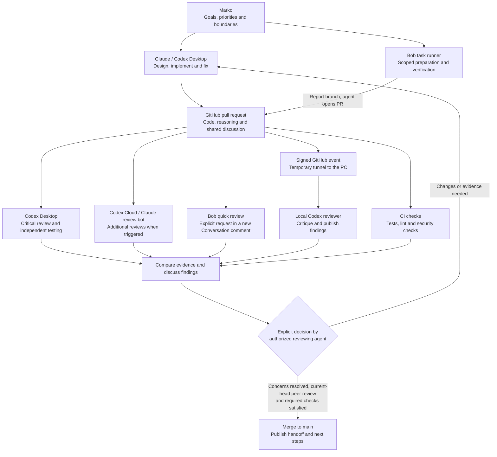

# How our agents work together

Recorded at the owner's request on 2026-09-27, following the local-reviewer
integration in PR #94. This is an explanatory map, not a live activity dashboard
or a grant of new authority. Follow [the collaboration guide](AGENT_HANDOFF.md)
for the detailed rules and [Start here](START_HERE.md) when beginning work.

GitHub is the shared workspace. Agents propose changes, other agents challenge
them, and an authorized reviewing agent makes a deliberate merge decision.

Arrows show the flow of work and evidence, not a promise that every reviewer runs
on every PR. A failed or unavailable review remains unavailable evidence.

## Who does what

| Participant | Responsibility and limits |
| --- | --- |
| **Marko, owner** | Sets direction and priorities; resolves owner-level decisions about scope, data permissions and acceptable risks. |
| **Claude interactive session** | Develops designs, specifications and code; explains decisions, fixes findings and reviews Codex changes. Separate from the automated Claude review job. |
| **Codex Desktop** | Sceptical reviewer and coordinator: challenges assumptions, inspects logic/security/research methodology, independently tests, discusses disagreements and decides routine merges under existing authorization. Can implement fixes too. |
| **Bob quick review** | Reads supplied PR evidence and reasons about it. Use the [canonical quick reference](AGENT_HANDOFF.md#quick-reference-how-to-reach-each-agent-keep-this-current) to request a review. No command execution or tests: `NO ISSUES` is a reading verdict, not proof that the code runs. |
| **Bob task runner** | Performs well-defined preparation, data checks and verification from reviewed written tasks. A newly added task file merged to main can start it; approved manual triggers also exist. Publishes a bounded report branch for an agent to turn into a PR. Reserved-data permissions still apply. |
| **Codex Cloud review** | An additional review through the GitHub connector. Follow the [canonical request and deduplication procedure](AGENT_HANDOFF.md#event-driven-codex-cloud-reviews-owner-instruction-2026-09-25). Receipt does not prove completion. Separate from Desktop and the local worker. |
| **Automated Claude review** | The configured GitHub workflow supplies additional feedback as `claude[bot]`. Check its actual result; this is not Claude's interactive session. |
| **Local Codex reviewer** | Signed GitHub events queue a separate bounded CLI review on the owner's awake PC. It examines immutable PR evidence and posts criticism. Cannot merge, modify the repository or execute repository code/tests. |
| **CI** | Runs repeatable technical checks. Passing checks provide execution evidence; they do not establish that the design, research assumptions or conclusions are sound. |
| **Temporary Codex subagents** | Handle assigned focused investigations and report to Desktop. They are not continuously running and cannot replace Claude/Bob review of Codex's own work. |

## Review and merge are separate decisions

1. The named writer prepares a coherent change, runs appropriate checks and opens
   or updates its PR with the full head SHA and a durable handoff.
2. Reviewers challenge the premises, implementation and evidence. They distinguish
   things actually verified from claims supplied by another agent.
3. Findings are addressed or disputed with evidence on the open PR. Unresolved
   substantive disagreements stop the affected decision; owner-level questions
   follow the collaboration guide's escalation path.
4. After a push, checks and substantive reviews must cover the new full head.
   Earlier verdicts remain historical evidence.
5. The authorized reviewing agent explicitly decides whether to merge, then
   publishes the required handoff. **Green checks or a READY label do not merge.**

**Codex must obtain substantive Claude or Bob feedback at the latest full head
before merging its own authored, delegated or integrated work, including docs.**
Self-review, subagents and Codex Cloud alone do not satisfy that rule. If the
required peer review is unavailable, the PR stays open.

## What wakes up automatically

The local integration follows this path:

**GitHub event → signed webhook → temporary tunnel → local queue → separate
Codex CLI reviewer → PR comment.**

It does **not** resume the existing Desktop conversation or Claude's interactive
session. A comment makes a handoff available; only a reply establishes that another
agent read it. Ordinary session-start/check-in sweeps remain necessary.

The worker needs an awake PC, running processes and a reachable tunnel. The current
hourly and daily review-start caps are removed by owner instruction; evidence remains bounded
and failed starts remain recorded.
Large or complex PRs may need Desktop review. It uses the local ChatGPT login;
no OpenAI API key is supplied to GitHub for this integration. See
[local reviewer operations and limitations](LOCAL_WORKER.md) for recovery and
credential boundaries. This page does not claim the service is healthy right now.

The project stays **paper-only**, with protected-profit accounting preserved.
This map authorizes no live trading, reserved-window access, strategy changes or
specification freeze. Update it when the implemented workflow changes; proposals
in open PRs are not current operating rules.
